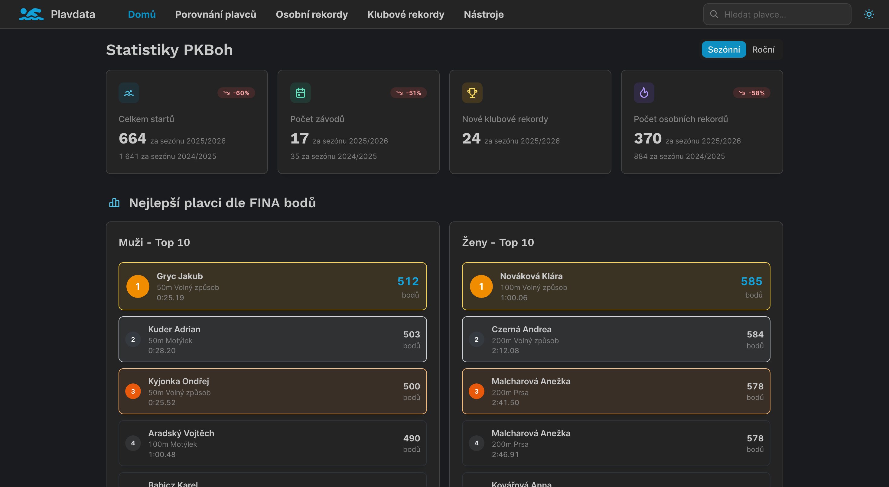

# Plavdata

Plavdata is a web app for analyzing swimming results for a single club using data from the Czech Swimming Association. It includes a public landing page with club statistics, personal bests, club records, relay building tools, and detailed swimmer profiles. You can also compare up to 8 swimmers on absolute or relative time axes to highlight performance across age gaps.


### Main page



See [more examples](docs/screenshots.md).

## Features

- Club overview with key statistics and dashboards.
- Personal bests and club records tables.
- Relay builder tools for comparing and assembling relay teams.
- Swimmer profile pages with performance history and stats.
- Multi-swimmer comparison (up to 8) with absolute and relative charts.

## Tech stack

- Backend: FastAPI (Python) with SQLite.
- Frontend: React + Vite with Mantine UI.
- Charts: Recharts.
- Deployment: Docker + Nginx (see `docker-compose*.yml`).

## Project structure

```
plavdata/
  backend/       FastAPI service, SQLite database, data scripts
  frontend/      React UI (Mantine)
  nginx/         Reverse proxy config
  docker-compose.yml
  docker-compose.prod.yml
```

## Getting started (dev)

### Prerequisites

- [Docker](https://docs.docker.com/get-docker/) and Docker Compose
- [uv](https://github.com/astral-sh/uv) (Python package manager, used for the one-time setup scripts)

### 1. Configure environment

Copy the example env file and fill in the values:

```bash
cp .env.prod.example .env
```

At minimum you must set:

- `TARGET_CLUB` — your club's abbreviation code from CSPS (e.g. `PKBoh`)
- `DATABASE_URL` — path to the SQLite file (default: `sqlite:////app/data/plavdata.db`)
- `VITE_API_BASE_URL` — backend API base URL (e.g. `http://localhost:8000`)

### 2. One-time database initialisation

This creates the SQLite file and tables, then fetches competition metadata from CSPS. **No running app needed** — it runs directly via `uv`:

```bash
make setup
```

This is equivalent to running the three steps in order:

```bash
make init-db                 # create schema
make sync-competition-tags   # fetch competition tag definitions
make sync-competitions       # fetch all competitions (~2002–today)
```

### 3. Start the stack

```bash
make dev
```

The backend runs on `http://localhost:8000` and the frontend on `http://localhost:3000`.

## Configuration

Key environment variables (see `.env` and `.env.prod.example`):

- `DATABASE_URL` (default in code: `sqlite:////app/data/database.db`)
- `VITE_API_BASE_URL` (frontend API base URL, e.g. `http://localhost:8000/api`)
- `ENV` (set to `development` to allow any CORS origin)
- `TARGET_CLUB` (CSPS club code to focus on)


